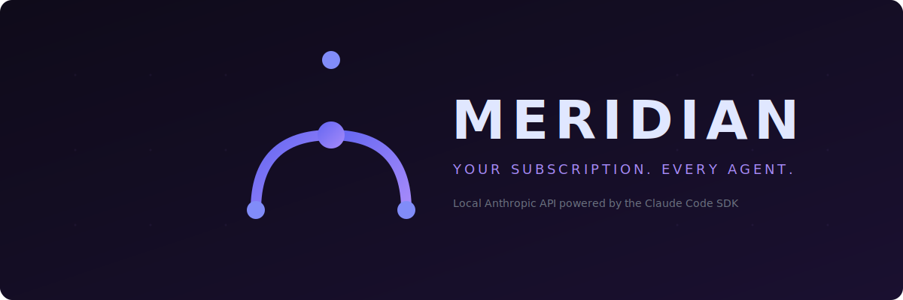

<p align="center">
  
</p>

<p align="center">
  <a href="https://github.com/rynfar/opencode-claude-max-proxy/releases"></a>
  <a href="https://www.npmjs.com/package/opencode-claude-max-proxy"></a>
  <a href="#"></a>
  <a href="#"></a>
</p>

---

Meridian turns your Claude Max subscription into a local Anthropic API. Any tool that speaks the Anthropic protocol — OpenCode, Crush, Cline, Continue, Aider — connects to Meridian and gets Claude, powered by your existing subscription through the official Claude Code SDK.

No API keys to manage. No third-party services. One subscription, every agent.

## Quick Start

```bash
# Install
npm install -g opencode-claude-max-proxy

# Authenticate (one time)
claude login

# Start
meridian
```

Meridian starts on `http://127.0.0.1:3456`. Point any Anthropic-compatible tool at it:

```bash
ANTHROPIC_API_KEY=x ANTHROPIC_BASE_URL=http://127.0.0.1:3456 opencode
```

The API key value doesn't matter — Meridian authenticates through your Claude Max session, not API keys.

## Why Meridian?

You're paying for Claude Max. It includes programmatic access through the Claude Code SDK. But your favorite coding tools expect an Anthropic API endpoint and an API key.

Meridian bridges that gap. It runs locally, accepts standard Anthropic API requests, and routes them through the SDK using your Max subscription. Claude does the work — Meridian just lets you pick the tool.

## How It Works

```
┌─────────────┐     ┌─────────────┐     ┌──────────────────┐     ┌───────────┐
│  Your Tool  │────▶│  Meridian   │────▶│  Claude Code SDK │────▶│  Claude   │
│  (OpenCode, │◀────│  (local)    │◀────│  (official)      │◀────│  (cloud)  │
│   Crush,    │     │  :3456      │     │                  │     │           │
│  Cline, …)  │     │             │     │                  │     │           │
└─────────────┘     └─────────────┘     └──────────────────┘     └───────────┘
     Anthropic           Bridges              Anthropic's            Your Max
     API format          the gap              own SDK               subscription
```

Your tool sends a standard Anthropic API request. Meridian translates it into a Claude Code SDK call. The SDK authenticates through your Max subscription. Claude responds. Meridian translates back. Your tool gets the response.

## Features

- **Standard Anthropic API** — drop-in compatible with any tool that supports custom `base_url`
- **Session management** — conversations persist across requests, survive compaction and undo, resume after proxy restarts
- **Streaming** — full SSE streaming with MCP tool filtering
- **Concurrent sessions** — run parent + subagent requests in parallel
- **Passthrough mode** — forward tool calls to the client instead of executing internally
- **Multimodal** — images, documents, and file attachments pass through to Claude
- **Telemetry dashboard** — real-time performance metrics at `/telemetry`
- **Cross-proxy resume** — sessions persist to disk and survive restarts
- **Agent adapter pattern** — extensible architecture for supporting new agent protocols

## Agent Setup

### OpenCode

```bash
ANTHROPIC_API_KEY=x ANTHROPIC_BASE_URL=http://127.0.0.1:3456 opencode
```

Or use the [OpenCode plugin](src/plugin/claude-max-headers.ts) for automatic session header injection.

### Crush

```jsonc
// ~/.config/crush/crush.json
{
  "providers": {
    "meridian": {
      "type": "anthropic",
      "base_url": "http://127.0.0.1:3456",
      "api_key": "x",
      "models": [
        { "id": "claude-sonnet-4-5-20250514", "name": "Claude Sonnet 4.5" },
        { "id": "claude-opus-4-20250514", "name": "Claude Opus 4" }
      ]
    }
  }
}
```

### Any Anthropic-compatible tool

```bash
export ANTHROPIC_API_KEY=x
export ANTHROPIC_BASE_URL=http://127.0.0.1:3456
# Then start your tool normally
```

## Tested Agents

| Agent | Status | Notes |
|-------|--------|-------|
| [OpenCode](https://github.com/opencode-ai/opencode) | ✅ Verified | Full tool support, session resume, streaming, subagents |
| [Crush](https://github.com/charmbracelet/crush) | ✅ Verified | Tool execution, multi-turn, headless mode |
| [Cline](https://github.com/cline/cline) | 🔲 Untested | Should work — standard Anthropic API |
| [Continue](https://github.com/continuedev/continue) | 🔲 Untested | Should work — standard Anthropic API |
| [Aider](https://github.com/paul-gauthier/aider) | 🔲 Untested | Should work — standard Anthropic API |

Tested an agent? [Open an issue](https://github.com/rynfar/opencode-claude-max-proxy/issues) and we'll add it.

## Architecture

Meridian is built as a modular proxy with clean separation of concerns:

```
src/proxy/
├── server.ts              ← HTTP orchestration (routes, SSE streaming, concurrency)
├── adapter.ts             ← AgentAdapter interface (extensibility point)
├── adapters/opencode.ts   ← OpenCode-specific behavior
├── query.ts               ← SDK query options builder
├── errors.ts              ← Error classification
├── models.ts              ← Model mapping (sonnet/opus/haiku)
├── tools.ts               ← Tool blocking lists
├── messages.ts            ← Content normalization
├── session/
│   ├── lineage.ts         ← Per-message hashing, mutation classification (pure)
│   ├── fingerprint.ts     ← Conversation fingerprinting
│   └── cache.ts           ← LRU session caches
├── sessionStore.ts        ← Cross-proxy file-based session persistence
├── agentDefs.ts           ← Subagent definition extraction
└── passthroughTools.ts    ← Tool forwarding mode
```

### Session Management

Sessions map agent conversations to Claude SDK sessions. Meridian classifies every incoming request:

| Classification | What Happened | Action |
|---------------|---------------|--------|
| **Continuation** | New messages appended | Resume SDK session |
| **Compaction** | Agent summarized old messages | Resume (suffix preserved) |
| **Undo** | User rolled back messages | Fork at rollback point |
| **Diverged** | Completely different conversation | Start fresh |

Sessions are stored in-memory (LRU) and persisted to `~/.cache/opencode-claude-max-proxy/sessions.json` for cross-proxy resume.

### Adding a New Agent

Implement the `AgentAdapter` interface in `src/proxy/adapters/`:

```typescript
interface AgentAdapter {
  getSessionId(c: Context): string | undefined
  extractWorkingDirectory(body: any): string | undefined
  normalizeContent(content: any): string
  getBlockedBuiltinTools(): readonly string[]
  getAgentIncompatibleTools(): readonly string[]
  getMcpServerName(): string
  getAllowedMcpTools(): readonly string[]
}
```

See [`adapters/opencode.ts`](src/proxy/adapters/opencode.ts) for reference.

## Configuration

| Variable | Default | Description |
|----------|---------|-------------|
| `CLAUDE_PROXY_PORT` | `3456` | Port to listen on |
| `CLAUDE_PROXY_HOST` | `127.0.0.1` | Host to bind to |
| `CLAUDE_PROXY_PASSTHROUGH` | unset | Forward tool calls to client instead of executing |
| `CLAUDE_PROXY_MAX_CONCURRENT` | `10` | Maximum concurrent SDK sessions |
| `CLAUDE_PROXY_MAX_SESSIONS` | `1000` | In-memory LRU session cache size |
| `CLAUDE_PROXY_MAX_STORED_SESSIONS` | `10000` | File-based session store capacity |
| `CLAUDE_PROXY_WORKDIR` | `cwd()` | Default working directory for SDK |
| `CLAUDE_PROXY_IDLE_TIMEOUT_SECONDS` | `120` | HTTP keep-alive timeout |
| `CLAUDE_PROXY_TELEMETRY_SIZE` | `1000` | Telemetry ring buffer size |

## Endpoints

| Endpoint | Description |
|----------|-------------|
| `GET /` | Landing page (HTML) or status JSON (`Accept: application/json`) |
| `POST /v1/messages` | Anthropic Messages API |
| `POST /messages` | Alias for `/v1/messages` |
| `GET /health` | Auth status, subscription type, mode |
| `GET /telemetry` | Performance dashboard |
| `GET /telemetry/requests` | Recent request metrics (JSON) |
| `GET /telemetry/summary` | Aggregate statistics (JSON) |
| `GET /telemetry/logs` | Diagnostic logs (JSON) |

## Docker

```bash
docker run -v ~/.claude:/home/claude/.claude -p 3456:3456 meridian
```

Or with docker-compose:

```bash
docker compose up -d
```

## Testing

```bash
npm test          # 339 unit/integration tests (bun test)
npm run build     # Build with bun + tsc
```

Three test tiers:

| Tier | What | Speed |
|------|------|-------|
| Unit | Pure functions, no mocks | Fast |
| Integration | HTTP layer with mocked SDK | Fast |
| E2E | Real proxy + real Claude Max ([`E2E.md`](E2E.md)) | Manual |

## FAQ

**Is this allowed by Anthropic's terms?**
Meridian uses the official Claude Code SDK — the same SDK Anthropic publishes and maintains for programmatic access. It authenticates through your existing Claude Max session using OAuth, not API keys. Nothing is modified, reverse-engineered, or bypassed.

**How is this different from using an API key?**
API keys are billed per token. Your Max subscription is a flat monthly fee with higher rate limits. Meridian lets you use that subscription from any compatible tool.

**Does it work with Claude Pro?**
It works with any Claude subscription that supports the Claude Code SDK. Max is recommended for the best rate limits.

**What happens if my session expires?**
The SDK handles token refresh automatically. If it can't refresh, Meridian returns a clear error telling you to run `claude login`.

## Contributing

Issues and PRs welcome. See [`ARCHITECTURE.md`](ARCHITECTURE.md) for module structure and dependency rules, [`CLAUDE.md`](CLAUDE.md) for coding guidelines, and [`E2E.md`](E2E.md) for end-to-end test procedures.

## License

MIT
